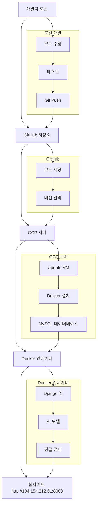

# 🫁 폐암 조기 진단 시스템 - 프로젝트 구성 및 배포 가이드

> **팀원들을 위한 완전한 프로젝트 이해 가이드**

---

## 📋 목차

1. [프로젝트 개요](#-프로젝트-개요)
2. [프로젝트 구조](#-프로젝트-구조)
3. [기술 스택](#-기술-스택)
4. [개발 환경 구성](#-개발-환경-구성)
5. [배포 과정](#-배포-과정)
6. [실제 운영 환경](#-실제-운영-환경)
7. [팀원 개발 가이드](#-팀원-개발-가이드)

---

## 🎯 프로젝트 개요

### 우리가 만든 것
- **웹사이트**: http://104.154.212.61:8000/ (현재 운영 중!)
- **기능**: 폐암 예측, 환자 관리, 데이터 시각화
- **기술**: Django + 머신러닝 + Docker + GCP

### 핵심 특징
- ✅ **AI 폐암 예측**: 15개 특성으로 91.94% 정확도
- ✅ **환자 관리**: CRUD 기능 완비
- ✅ **데이터 시각화**: 한글 폰트 지원 차트
- ✅ **클라우드 배포**: Google Cloud Platform
- ✅ **컨테이너화**: Docker로 일관된 환경

---

## 📁 프로젝트 구조

```
Django_project/                    # ← 우리 프로젝트 루트 폴더
│
├── lungcancer_project/            # ← Django 프로젝트 설정 (Django가 작동하는 핵심)
│   ├── settings.py               # ← 데이터베이스, 보안 등 모든 설정
│   ├── urls.py                   # ← 메인 URL 라우팅 (어떤 URL이 어떤 페이지로 갈지)
│   ├── wsgi.py                   # ← 웹 서버 연결 설정
│   └── asgi.py                   # ← 비동기 웹 서버 설정
│
├── lungcancer/                   # ← 우리가 만든 실제 기능들
│   ├── models.py                 # ← 데이터베이스 테이블 구조 (환자, 예측결과 등)
│   ├── views.py                  # ← 실제 로직 (예측, 환자관리 등)
│   ├── templates/                # ← HTML 페이지들
│   │   ├── home.html            # ← 홈페이지
│   │   ├── predict.html         # ← 폐암 예측 페이지
│   │   ├── patient_list.html    # ← 환자 관리 페이지
│   │   └── visualization.html   # ← 데이터 시각화 페이지
│   ├── ml_model/                 # ← AI 모델 저장소
│   │   ├── lung_cancer_model.pkl    # ← 학습된 AI 모델
│   │   └── feature_names.pkl        # ← 입력 특성 이름들
│   └── urls.py                   # ← 앱 내부 URL 설정
│
├── static/                       # ← CSS, 이미지 등 정적 파일
│   ├── css/home.css             # ← 홈페이지 스타일
│   └── img/폐암_이미지.jpeg        # ← 홈페이지 이미지
│
├── manage.py                     # ← Django 관리 스크립트
├── requirements.txt              # ← Python 패키지 목록
├── Dockerfile                    # ← Docker 이미지 설정
├── docker-compose.yml            # ← Docker 컨테이너 설정
└── README.md                     # ← 프로젝트 문서
```

### 🔍 각 폴더의 역할

| 폴더/파일 | 역할 | 설명 |
|-----------|------|------|
| `lungcancer_project/` | Django 설정 | 웹서버가 작동하는 핵심 설정들 |
| `lungcancer/` | 실제 기능 | 우리가 만든 폐암 예측, 환자 관리 기능 |
| `static/` | 정적 파일 | CSS, 이미지 등 웹페이지 디자인 |
| `manage.py` | Django 관리 | 서버 실행, 데이터베이스 관리 등 |
| `Dockerfile` | 컨테이너 설정 | Docker로 앱을 패키징하는 방법 |
| `docker-compose.yml` | 컨테이너 실행 | Docker 컨테이너를 어떻게 실행할지 |

---

## 🛠 기술 스택

### Backend (서버)
- **Django 4.2.25**: 웹 프레임워크 (Python 기반)
- **MySQL**: 운영 데이터베이스 (GCP 서버)
- **SQLite**: 로컬 개발 데이터베이스

### AI/ML (인공지능)
- **scikit-learn 1.6.1**: 머신러닝 라이브러리
- **Random Forest**: 폐암 예측 알고리즘
- **pandas, numpy**: 데이터 처리

### Frontend (화면)
- **Bootstrap 5**: UI 프레임워크
- **HTML/CSS**: 웹페이지 구조와 디자인
- **matplotlib**: 차트 생성 (한글 폰트 지원)

### DevOps (배포)
- **Docker**: 컨테이너화
- **Google Cloud Platform**: 클라우드 서버
- **Git**: 코드 버전 관리

---

## 🏗 개발 환경 구성

### 1. 로컬 개발 환경
```bash
# 1. 프로젝트 폴더로 이동
cd "/Users/nogeon-u/Desktop/건양대_바이오메디컬 /Django/Django_project"

# 2. Python 가상환경 생성
python -m venv venv
source venv/bin/activate  # Windows: venv\Scripts\activate

# 3. 패키지 설치
pip install -r requirements.txt

# 4. 데이터베이스 설정
python manage.py migrate

# 5. 서버 실행
python manage.py runserver
```

### 2. Docker 개발 환경 (권장)
```bash
# 1. 프로젝트 폴더로 이동
cd "/Users/nogeon-u/Desktop/건양대_바이오메디컬 /Django/Django_project"

# 2. Docker 컨테이너 실행
docker-compose up --build

# 3. 브라우저에서 접속
# http://localhost:8000
```

---

## 🚀 배포 과정

### 전체 배포 아키텍처



### 단계별 배포 과정

#### 1단계: 로컬 개발
```bash
# 개발자가 코드를 수정
vim lungcancer/views.py  # 예: 새로운 기능 추가

# 로컬에서 테스트
python manage.py runserver
# http://localhost:8000 에서 확인
```

#### 2단계: GitHub 업로드
```bash
# 변경사항을 Git에 추가
git add .
git commit -m "새로운 기능 추가"
git push origin main
```

#### 3단계: GCP 서버 배포
```bash
# GCP 서버에 SSH 접속
ssh username@104.154.212.61

# 최신 코드 다운로드
cd ~/lung-cancer-prediction-system
git pull origin main

# Docker 컨테이너 재시작
sudo docker-compose down
sudo docker-compose build --no-cache
sudo docker-compose up -d
```

#### 4단계: 웹사이트 확인
- 브라우저에서 http://104.154.212.61:8000/ 접속
- 변경사항이 반영되었는지 확인

---

## 🌐 실제 운영 환경

### 서버 정보
- **서버**: Google Cloud Platform (GCP)
- **IP 주소**: 104.154.212.61
- **포트**: 8000
- **웹사이트**: http://104.154.212.61:8000/

### 데이터베이스
- **운영**: MySQL (GCP 서버)
- **개발**: SQLite (로컬)
- **데이터**: 환자 정보, 예측 결과, 공지사항, Q&A

### Docker 컨테이너
```yaml
# docker-compose.yml
version: '3.8'
services:
  web:
    build: .
    ports:
      - "8000:8000"
    environment:
      - DEBUG=False
      - ALLOWED_HOSTS=104.154.212.61
    restart: unless-stopped
```

---

## 👥 팀원 개발 가이드

### 새로운 기능 추가하는 방법

#### 1. 코드 수정
```bash
# 1. 프로젝트 폴더로 이동
cd "/Users/nogeon-u/Desktop/건양대_바이오메디컬 /Django/Django_project"

# 2. 코드 수정 (예: 새로운 페이지 추가)
# - lungcancer/views.py: 새로운 기능 로직
# - lungcancer/templates/: 새로운 HTML 페이지
# - lungcancer/urls.py: 새로운 URL 추가
```

#### 2. 로컬 테스트
```bash
# Docker로 테스트
docker-compose up --build
# http://localhost:8000 에서 확인
```

#### 3. GitHub 업로드
```bash
git add .
git commit -m "새로운 기능: [기능명]"
git push origin main
```

#### 4. 서버 배포
```bash
# GCP 서버에서 실행
ssh username@104.154.212.61
cd ~/lung-cancer-prediction-system
git pull origin main
sudo docker-compose down
sudo docker-compose build --no-cache
sudo docker-compose up -d
```

### 자주 사용하는 명령어

#### 로컬 개발
```bash
# 서버 실행
python manage.py runserver

# 데이터베이스 마이그레이션
python manage.py makemigrations
python manage.py migrate

# 관리자 생성
python manage.py createsuperuser
```

#### Docker 사용
```bash
# 컨테이너 실행
docker-compose up

# 컨테이너 중지
docker-compose down

# 컨테이너 재빌드
docker-compose build --no-cache
```

#### Git 사용
```bash
# 상태 확인
git status

# 변경사항 추가
git add .

# 커밋
git commit -m "변경사항 설명"

# 푸시
git push origin main
```

---

## 🔧 문제 해결

### 자주 발생하는 문제들

#### 1. 포트 충돌
```bash
# 해결방법: 다른 포트 사용
python manage.py runserver 8001
```

#### 2. 데이터베이스 오류
```bash
# 해결방법: 마이그레이션 재실행
python manage.py makemigrations
python manage.py migrate
```

#### 3. Docker 오류
```bash
# 해결방법: 컨테이너 완전 재시작
docker-compose down
docker system prune -f
docker-compose up --build
```

#### 4. 한글 폰트 문제
```bash
# 해결방법: Docker 컨테이너 재빌드
docker-compose down
docker-compose build --no-cache
docker-compose up -d
```

---

## 📊 프로젝트 현황

### ✅ 완료된 기능
- 🫁 **폐암 예측 시스템**: 91.94% 정확도
- 👥 **환자 관리**: CRUD 기능
- 📊 **데이터 시각화**: 한글 폰트 지원
- 🔐 **사용자 인증**: 로그인/회원가입
- 📢 **공지사항/Q&A**: 관리자 기능
- 🐳 **Docker 배포**: 컨테이너화
- ☁️ **GCP 클라우드**: 안정적인 운영

### 🌐 운영 환경
- **웹사이트**: http://104.154.212.61:8000/ ✅ **현재 운영 중**
- **서버**: Google Cloud Platform
- **데이터베이스**: MySQL
- **컨테이너**: Docker

### 📈 성능 지표
- **모델 정확도**: 91.94%
- **학습 데이터**: 309개 환자 샘플
- **입력 특성**: 15개
- **배포 방식**: Docker + GCP

---

## 🎯 다음 단계

### 팀원들이 할 수 있는 것들
1. **기능 개선**: 새로운 예측 특성 추가
2. **UI/UX 개선**: 페이지 디자인 수정
3. **데이터 분석**: 더 많은 시각화 추가
4. **성능 최적화**: 예측 속도 향상

### 개발 워크플로우
```
코드 수정 → 로컬 테스트 → GitHub 푸시 → 서버 배포 → 웹사이트 확인
```

---

## 📞 지원 및 문의

- **프로젝트 관리자**: [관리자 연락처]
- **GitHub 저장소**: https://github.com/nogeonu/lung-cancer-prediction-system
- **운영 웹사이트**: http://104.154.212.61:8000/

---

**© 2025 건양대학교 바이오메디컬공학과 1팀. All rights reserved.**
